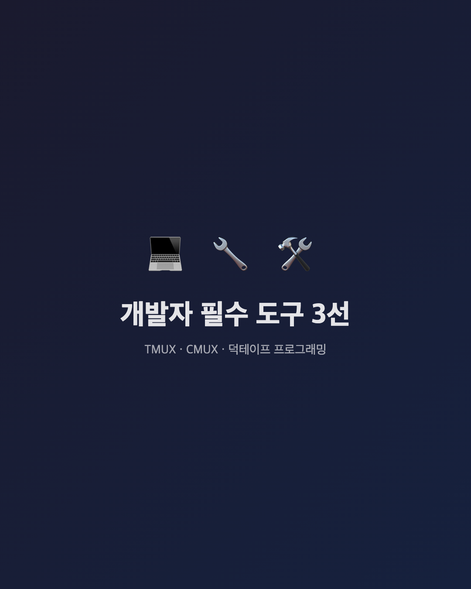
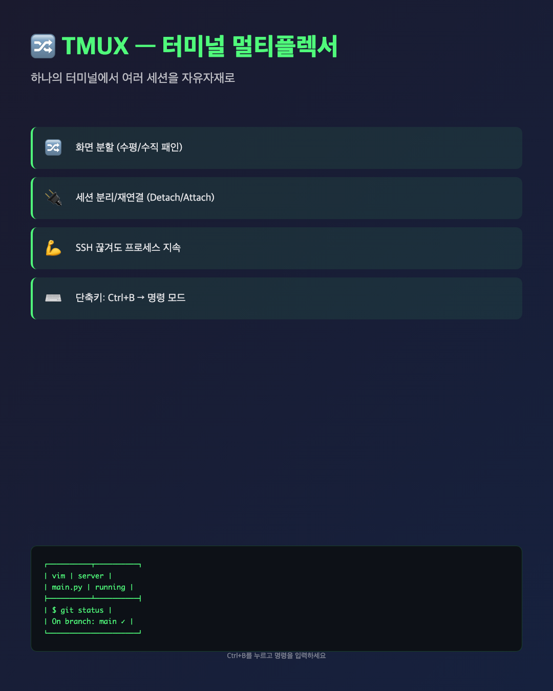
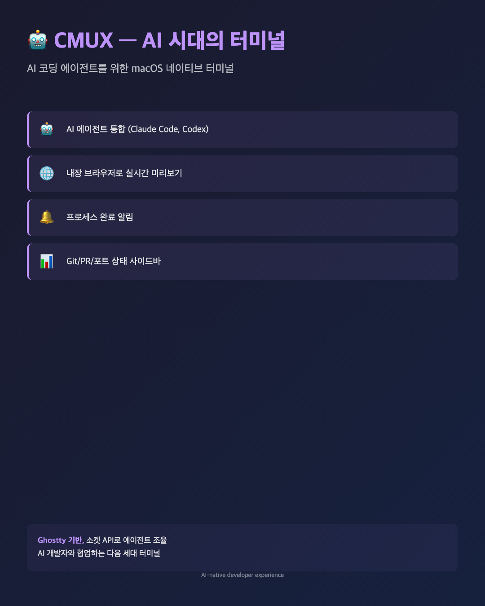

# 개발자 필수 도구 3선

> TMUX · CMUX · 덕테이프 프로그래밍 — 터미널부터 철학까지



---

## 1. TMUX — 터미널 멀티플렉서



**한마디:** 하나의 터미널에서 여러 세션을 자유자재로 관리하는 도구

터미널 작업을 하다 보면 여러 창을 왔다 갔다 하는 게 번거롭습니다. TMUX는 하나의 터미널 안에서 화면을 나누고, 여러 세션을 동시에 관리할 수 있게 해줍니다.

### 핵심 기능

- **화면 분할** — 수평(`Ctrl+B "`)·수직(`Ctrl+B %`) 패인으로 자유롭게 분할
- **세션 분리/재연결** — `Ctrl+B D`로 분리, `tmux attach`로 재연결
- **SSH 끊겨도 지속** — 원격 서버에서 빌드 돌려놓고 안심하고 퇴근
- **윈도우 관리** — 탭처럼 여러 윈도우 생성·이동

### 실전 예시

```bash
# 새 세션 생성
tmux new -s dev

# 화면 수직 분할
Ctrl+B %

# 세션 분리 (백그라운드 유지)
Ctrl+B D

# 나중에 재연결
tmux attach -t dev
```

원격 서버에서 장시간 작업할 때, TMUX 없이는 살 수 없습니다.

---

## 2. CMUX — AI 시대의 터미널



**한마디:** AI 코딩 에이전트를 위해 설계된 macOS 네이티브 터미널

CMUX는 Ghostty 기반의 차세대 터미널입니다. Claude Code, Codex, Aider 같은 AI 코딩 에이전트와 함께 쓸 때 진가를 발휘합니다.

### 핵심 기능

- **AI 에이전트 통합** — 소켓 API로 Claude Code, Codex 등과 직접 통신
- **내장 브라우저** — 터미널 옆에서 개발 서버 실시간 미리보기
- **스마트 알림** — 프로세스 완료 시 알림 링 + 데스크톱 알림
- **사이드바** — Git 브랜치, PR 상태, 포트 모니터링 한눈에

### 왜 주목해야 하나?

AI 에이전트가 코드를 생성하는 동안 내장 브라우저로 결과를 실시간 확인하고, 여러 에이전트 작업을 사이드바에서 추적할 수 있습니다. AI 시대에 맞춰 터미널도 진화하고 있습니다.

공식 사이트: [cmux.com](https://cmux.com)

---

## 3. 덕테이프 프로그래밍


**한마디:** 완벽보다 "동작하는 코드"가 먼저다

Joel Spolsky가 2009년 글에서 소개한 개념입니다. 최고의 프로그래머는 화려한 기술을 쓰는 사람이 아니라, **실용적으로 문제를 해결하고 제품을 배포하는 사람**이라는 철학입니다.

### 핵심 원칙

> "50% 완성된 솔루션이 실제로 사용되는 것이 99% 완성된 미완성 제품보다 낫다"

- ✅ **단순한 코드**로 빠르게 출시
- ✅ **과도한 설계**(over-engineering) 회피
- ✅ **실용적 문제 해결** 우선
- ❌ 완벽한 아키텍처에 6개월 소비

### 실전 교훈

스타트업에서 MVP를 만들 때, 6개월 동안 완벽한 아키텍처를 설계하는 대신 3주 만에 단순한 코드로 작동하는 프로토타입을 출시하고, 사용자 피드백을 수집하는 게 더 낫습니다.

**덕테이프 프로그래머의 도구함:** 검증된 라이브러리, 단순한 구조, 빠른 배포, 그리고 피드백 루프.

---

## 마무리

| 도구/철학 | 한 줄 요약 | 추천 대상 |
|----------|----------|----------|
| **TMUX** | 터미널 분할·세션 관리 | 서버 관리자, 원격 작업자 |
| **CMUX** | AI 에이전트용 차세대 터미널 | AI 코딩 도구 사용자 |
| **덕테이프** | 실용주의 프로그래밍 철학 | 모든 개발자 |

세 가지 모두 **생산성을 높이는** 공통점이 있습니다. 도구든 철학이든, 결국 중요한 건 **실제로 동작하는 결과물**을 만드는 것입니다.
