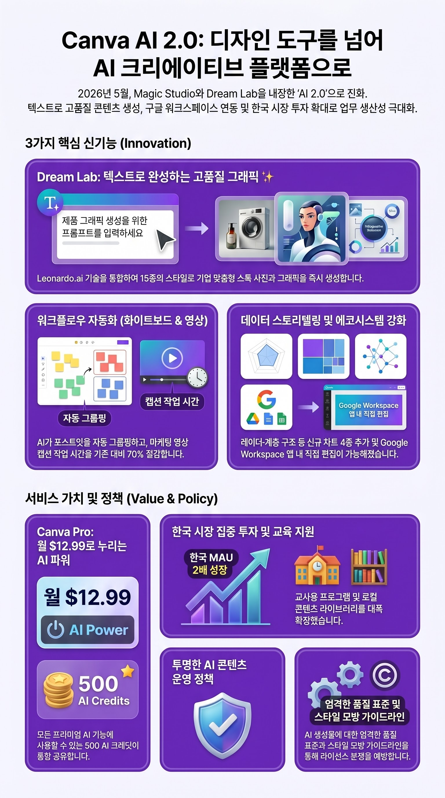

# Canva AI 2.0 — 단순 디자인 도구를 넘어 크리에이티브 플랫폼으로

> Canva Create 2026 발표를 중심으로 한국 사용자 시각에서 정리한 한 페이지. 인포그래픽 1장으로 전체 흐름을 먼저 보고, 본문에서 디테일을 채운다.

## 한 장으로 보는 정리

> 🎨 *제목: AI 디자인 플랫폼의 새로운 진화 — NotebookLM 자동 생성, bento-grid 스타일.*

---

## 한 줄 요약

Magic Studio + Dream Lab + AI 동영상 생성이 메인 인터페이스에 내장되어, **1.9억+ 글로벌 사용자**가 별도 도구 없이 텍스트 한 줄로 디자인·이미지·영상을 만들 수 있게 됐다.

---

## 핵심 신기능 6가지

### 1. Dream Lab — 텍스트 → 이미지·그래픽

- **기반**: Leonardo.ai 인수 후 통합
- **스타일 15종**: 3D 렌더링 / 일러스트레이션 / 사진리얼 / 수채화 등
- **활용 사례**: 기업 맞춤형 스톡 사진을 텍스트 한 줄로 생성. 라이선스 스톡 사이트 의존도 감소.

### 2. 화이트보드 AI

- **AI 분류·요약**: 회의 중 흩어진 포스트잇을 주제별 자동 그룹핑
- **실시간 투표 스티커**: 팀 의사결정 즉시 가시화
- **매직 글쓰기**: 문맥에 맞는 문장 자동 생성

협업 보드를 단순 메모판에서 의사결정 도구로 변환한다.

### 3. 동영상 자동 캡션

- **브랜드 스타일 적용**: 폰트·색상·위치를 회사 기존 스타일로 자동 적용
- **시간 단축**: 기존 수동 작업 대비 마케팅 동영상 캡션 시간 큰 폭 절감

### 4. 신규 차트 유형 4가지

- **영역**(Area) — 시계열 누적 데이터
- **레이더**(Radar) — 다차원 비교
- **계층 구조**(Hierarchy) — 트리·조직도
- **통계**(Statistical) — 분포·분산

프레젠테이션의 데이터 스토리텔링이 강화된다.

### 5. Google Workspace 깊은 연동

- Gmail / Drive / Calendar에서 **직접 Canva 디자인 열기·편집·공동 작업**
- 첨부파일을 한 클릭으로 Canva 변환
- Calendar 이벤트가 자동으로 디자인 태그·정리

### 6. 한국 시장 집중 투자

- **교육 전문 크리에이터 프로그램**: 교사·학교 대상
- **한국 MAU 1년간 2배** 증가 (Canva 한국 발표)
- 한국어 콘텐츠 라이브러리 확장

---

## 요금 정책

| 플랜 | 가격 | 핵심 |
|---|---|---|
| Canva Pro | **$12.99/월** | 모든 프리미엄 AI 기능 + 월 500 AI 크레딧 공유 |
| Canva Free | $0 | 기본 디자인 + 일부 AI 기능 |
| Teams / Enterprise | 별도 견적 | 팀 협업·브랜드 키트·관리 도구 |

500 크레딧이 이미지·동영상·Magic Design·Canva Code 등 모든 AI 기능에 **공유**되는 구조다. 한 카테고리에 몰아 써도 무방하다.

## 정책 변경 — 2026년 1월 Contributor Agreement

- **품질 표준 명문화**: AI로 생성된 콘텐츠도 검토 기준 적용
- **AI 콘텐츠 규칙 명확화**: AI 생성·합성 명시 필수, 스타일 모방 가이드라인
- **투명한 검토·시행**: 거절 사유·이의제기 절차 공개

기여자 입장에선 진입장벽이 올라갔지만 AI 시대의 라이선스 분쟁을 사전에 줄이는 효과가 있다.

---

## 한국 사용자 입장에서 시사점

1. **교육 영역** — 교사용 프로그램이 활성화되며 미디어 리터러시·디지털 시민교육 자료 제작 비용이 내려간다.
2. **소상공인·1인 마케터** — Dream Lab + 자동 캡션으로 외주 비용을 큰 폭으로 줄일 수 있다.
3. **직장인** — Google Workspace 연동으로 메일·문서 작업 흐름에 디자인이 통합된다. 별도 앱 전환 마찰이 사라진다.
4. **콘텐츠 크리에이터** — 무료 스톡 의존도가 낮아지고 본인 스타일 일관성을 유지하기 쉬워진다.

---

## 출처

- [Canva 대규모 업데이트 핵심 5가지 — DI Today (한국어)](https://ditoday.com/ai-%ED%92%88%EC%9D%80-%EC%BA%94%EB%B0%94-%EB%8C%80%EA%B7%9C%EB%AA%A8-%EC%97%85%EB%8D%B0%EC%9D%B4%ED%8A%B8-%ED%95%B5%EC%8B%AC-5%EA%B0%80%EC%A7%80/)
- [Canva 공식 런칭 페이지](https://www.canva.com/launches/)
- [Canva AI 2.0 발표 — 뉴스룸](https://www.canva.com/newsroom/news/canva-create-2026-ai/)
- [Canva Release Notes — May 2026 (Releasebot)](https://releasebot.io/updates/canva)
- [Canva AI 리뷰 2026 (WaveSpeed AI)](https://wavespeed.ai/blog/ko/posts/canva-ai-review-2026/)

---

> 🛠 **인포그래픽**: Google NotebookLM (`notebooklm-py 0.4.0`, bento-grid + portrait + 한국어).  
> 📝 **본문 정리**: WebSearch + WebFetch로 한국어·영문 1차 출처 6건 종합.  
> 📅 **작성**: 2026-05-10
