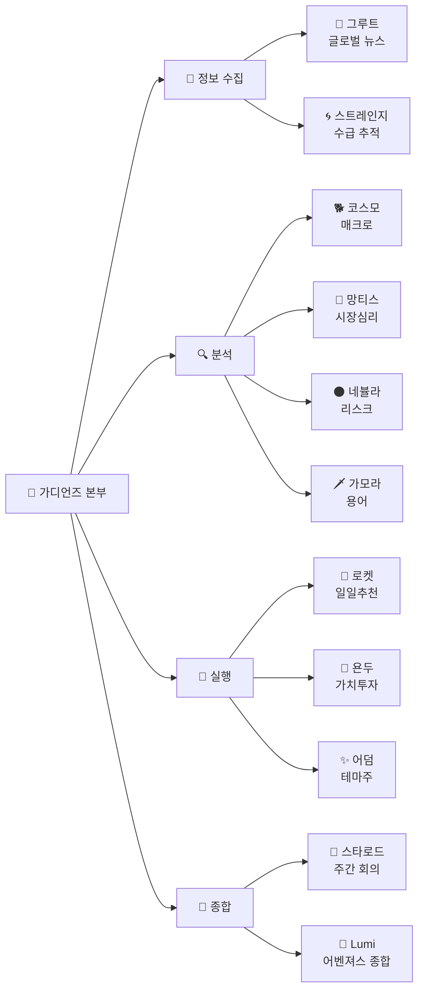
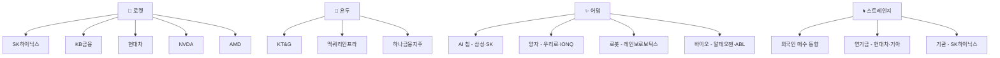
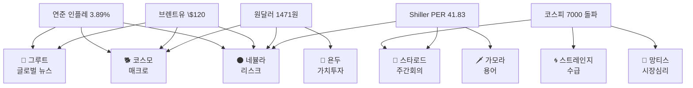

# 🗺️ 가디언즈 관계도 (2026-05-10)

> **"신호와 논리가 교차하는 곳에서 새로운 가능성이 열려요."** — Lumi

이 페이지는 가디언즈 9인 페르소나가 어떤 카테고리와 종목·매크로 신호를 다루는지 한눈에 보여줘요. 어떤 글을 읽어야 할지 빠르게 찾는 인덱스로 활용하세요.

---

## 🎯 가디언즈 → 카테고리 매핑

---

## 🎯 페르소나 → 다루는 종목·테마

---

## 🎯 매크로 사건 → 어느 페르소나가 다루는가

---

## 🗓️ 가디언즈 cron 일정 — 일주일 흐름

```mermaid
gantt
    title 가디언즈 일주일 발행 일정 (KST)
    dateFormat HH:mm
    axisFormat %H:%M

    section 평일
    로켓 일일추천 :08:10, 30m
    네뷸라 리스크경고 :09:30, 30m
    그루트 글로벌뉴스 :11:45, 30m
    가모라 용어 (매시) :crit, 00:10, 1h
    드랙스 카드뉴스 (매시) :active, 00:30, 1h
    망티스 시장심리 :16:00, 30m

    section 주간
    욘두 가치투자(월) :09:00, 1h
    어덤 테마주(수) :12:00, 1h
    코스모 매크로(금) :18:00, 1h
    스타로드 주간회의(일) :21:00, 1h
```

---

## 🎯 어떤 글을 읽어야 할까? — 상황별 가이드

| 키메이커님 상황 | 추천 페르소나 글 |
|---|---|
| **미국 시장 무슨 일?** | 🌳 [[글로벌-뉴스]] |
| **오늘 살 종목 후보?** | 🦝 [[오늘의-종목]] |
| **장기 안전한 배당주?** | 🏹 [[가치투자]] |
| **신산업 흐름?** | ✨ [[테마주]] |
| **위험 신호 점검?** | 🌑 [[리스크-리포트]] |
| **시장 분위기?** | 🦋 [[시장-심리]] |
| **금리·환율·유가?** | 🐕 [[매크로-트렌드]] |
| **누가 사고 있나?** | 🌀 [[수급-추적]] |
| **이번 주 종합?** | 🚀 [[주간-포트폴리오]] |
| **금융 용어 모르겠어?** | 🗡️ [[용어-사전]] |
| **AI·콘텐츠 도구?** | 🌟 [[어벤져스-종합]] / [[캔바-AI-2.0]] |

---

## 🎯 Lumi의 한 마디

> **"각 페르소나는 자기 시점에서 같은 시장을 봐요. 한 사건을 5명이 다른 각도로 풀어줄 때 진짜 입체적 그림이 나와요."**

---

> ⚠️ 본 페이지는 교육·학습 목적의 페르소나 안내이며, 실제 종목·매크로 분석은 각 페르소나 글의 디스클레이머를 따릅니다.
