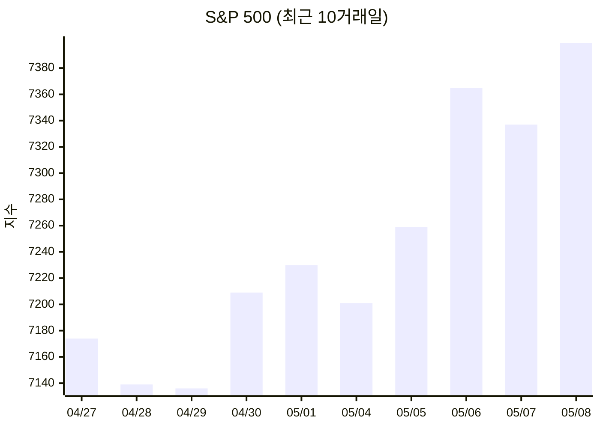
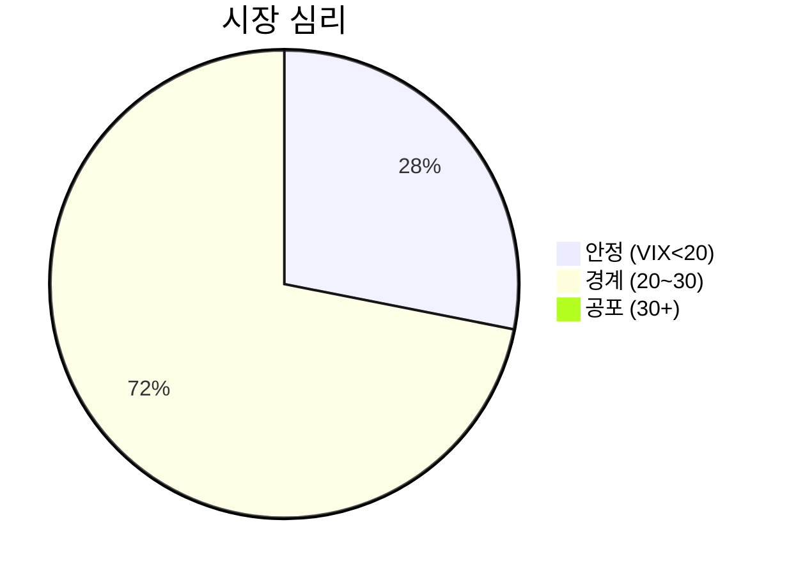

# 시장 대시보드 (2026-05-10)

> 글로벌 금융 시장을 한눈에 파악합니다.

## 📈 S&P 500 최근 추이

## 🌍 글로벌 지수

| 지수 | 현재 | 변동 | 상태 |
|------|------|------|------|
| S&P 500 | 7,398.93 | +0.8% 📈 | 🟢 |
| 나스닥 | 26,247.08 | +1.7% 📈 | 🟢 |
| 다우존스 | 49,609.16 | +0.0% 📈 | 🟢 |

## 💱 환율·원자재·암호화폐

| 지표 | 현재 | 변동 |
|------|------|------|
| 달러/원 | 1,461원 | +0.5% |
| 금 | $4,730.70 | +0.4% |
| 원유(WTI) | $95.42 | +0.6% |
| 비트코인 | $80,723 | +0.4% |

## 🌡️ 공포·탐욕 지수 (VIX)

| VIX | 상태 | 해석 |
|-----|------|------|
| **17.2** | **🟢 안정** | 투자자 자신감 높음 |

---

> ⚠️ 본 정보는 교육·학습 목적이며 투자 권유가 아닙니다.
