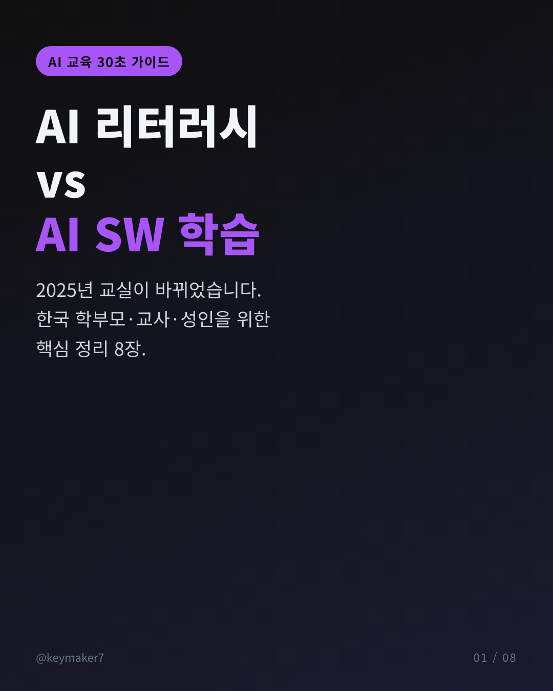
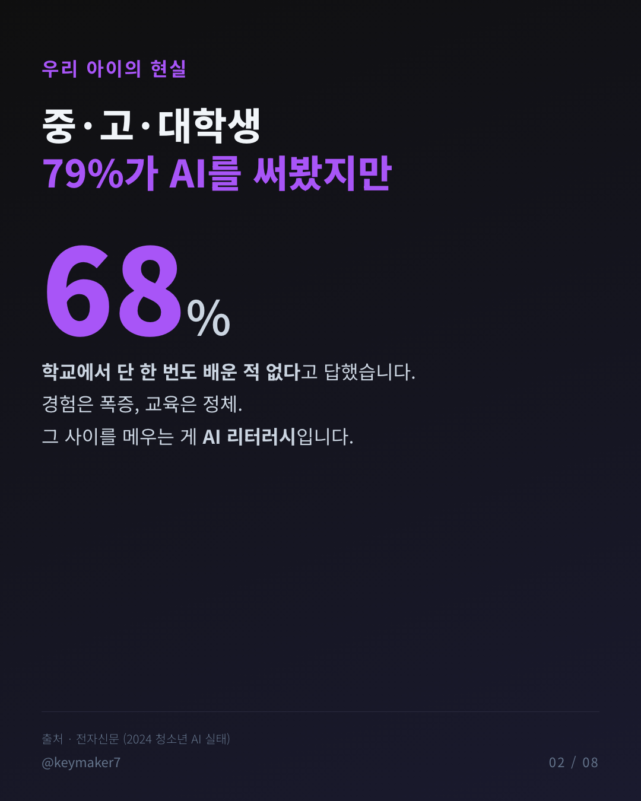
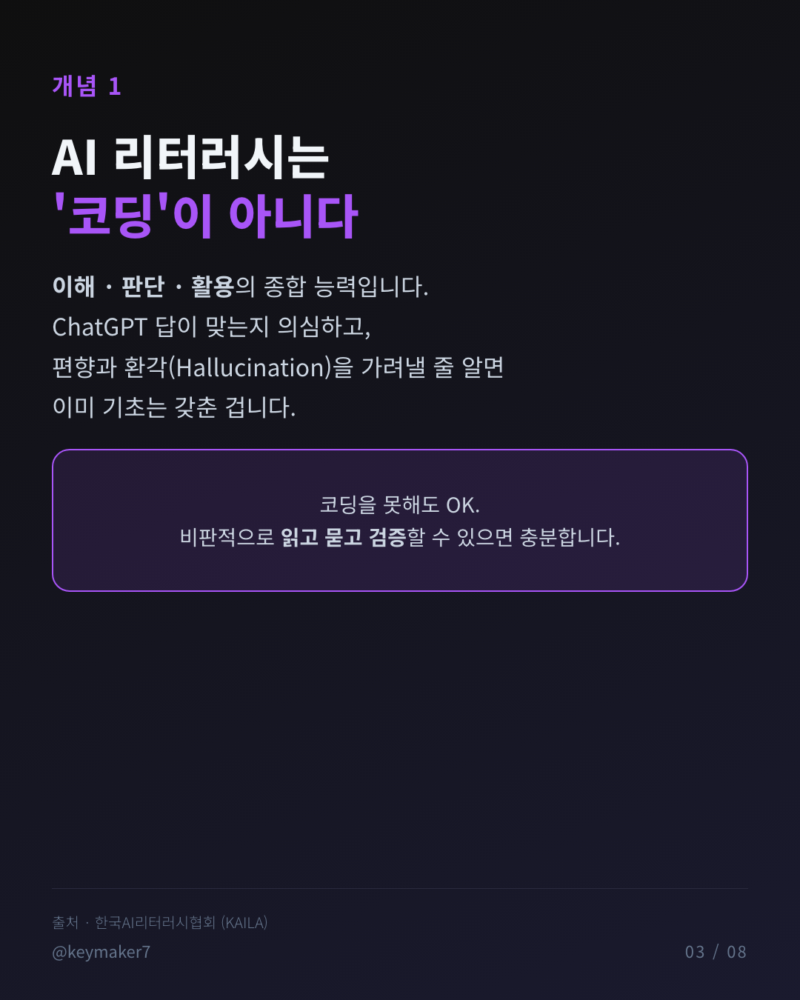
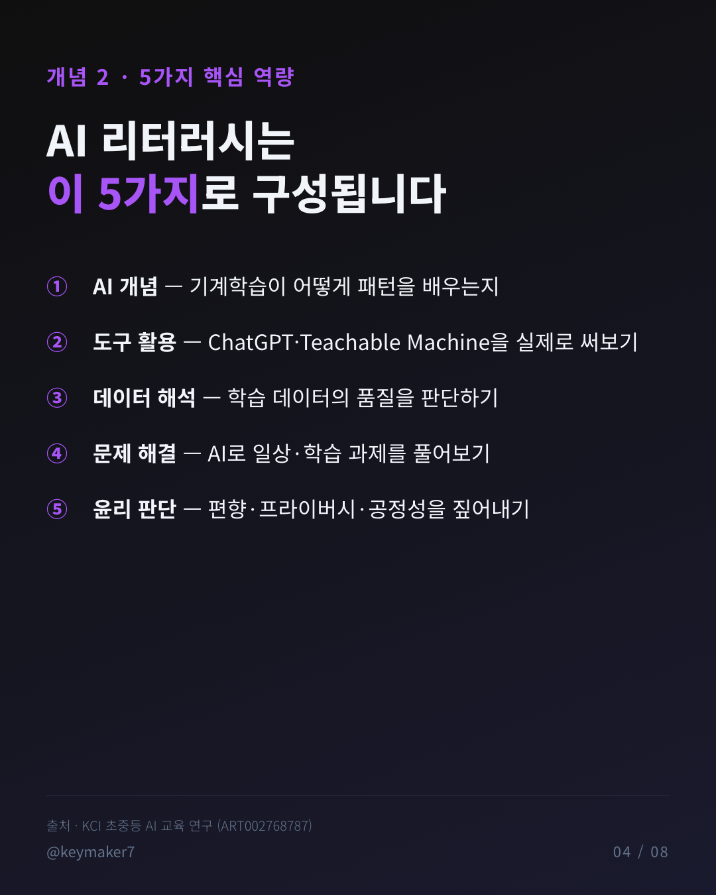
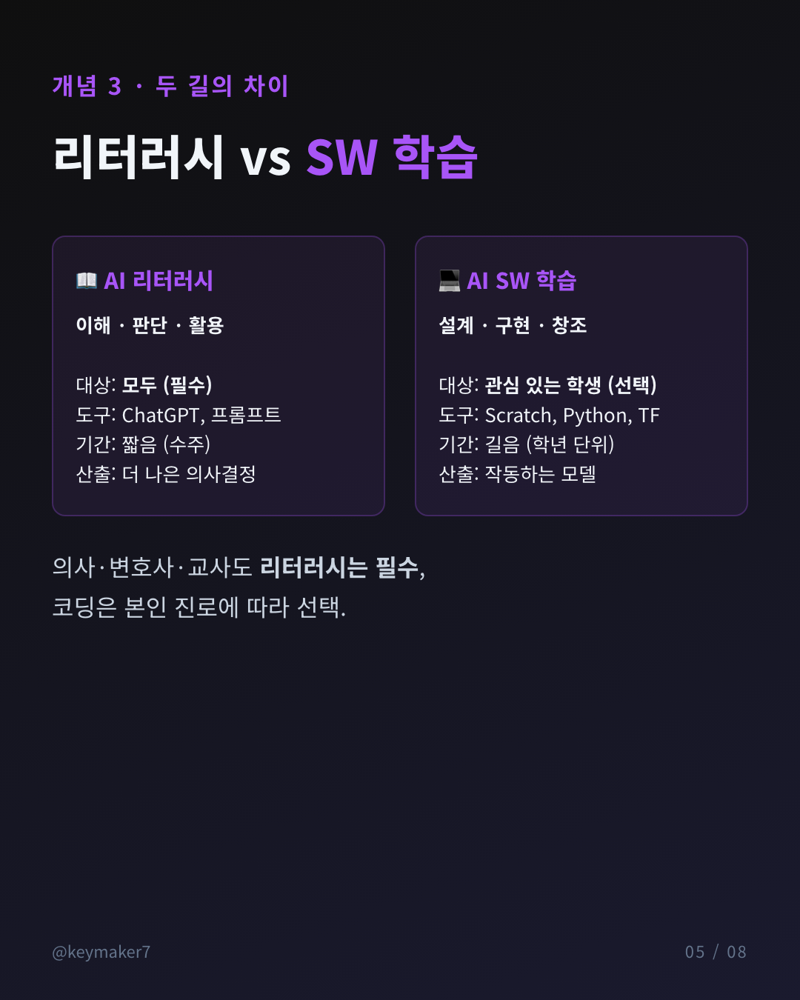
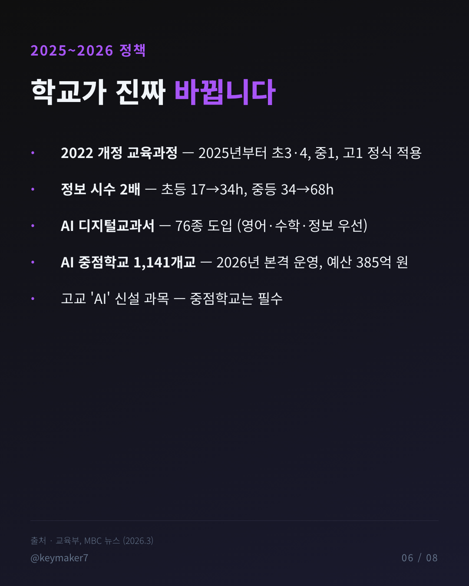
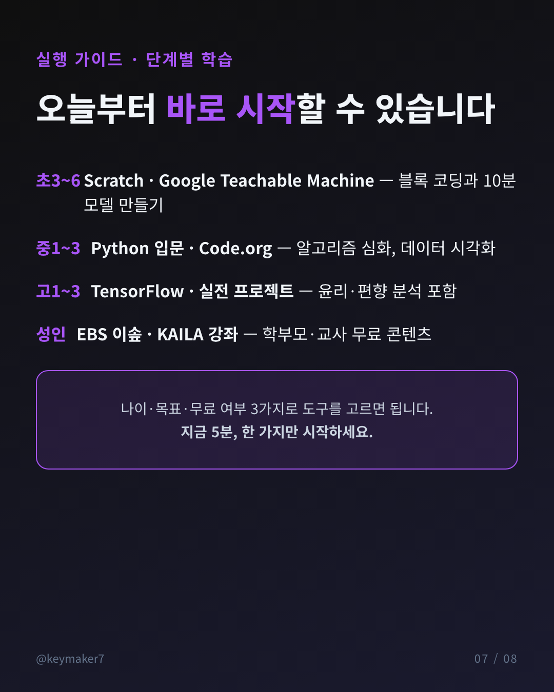
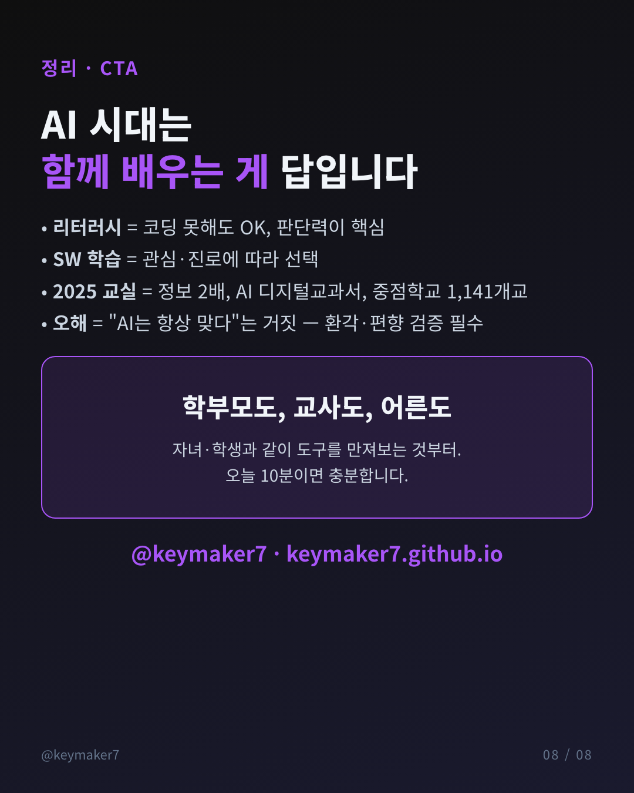

# 🧠 AI 리터러시 vs AI SW 학습

> **"AI 리터러시는 '판단력'이고, AI SW 학습은 '구현력'이다."**
> 둘은 보완 관계 — 모두에게 필요한 건 리터러시, 본인 진로에 따라 더하는 게 SW 학습.

---

## 🎯 한 줄 요약

중·고·대학생의 **79%가 생성형 AI를 써봤지만, 68%는 학교에서 단 한 번도 배운 적이 없다**고 답했습니다. 이 간극을 메우는 게 **AI 리터러시 교육**입니다. 2025년 2022 개정 교육과정이 본격 적용되고, 2026년부터 **AI 중점학교 1,141개교**가 본격 가동되면서 한국 교실이 빠르게 바뀌고 있습니다. 이 글은 학부모·교사·일반 성인 학습자를 위한 30초 가이드입니다.

---

## 📸 카드뉴스 8장

---

## 1. 두 개념의 차이

| 구분 | AI 리터러시 | AI SW 학습 |
|---|---|---|
| **목표** | 이해 · 판단 · 활용 | 설계 · 구현 · 창조 |
| **대상** | **모두 (필수)** | 관심 있는 학생 (선택) |
| **도구** | ChatGPT, 프롬프트 엔지니어링 | Python, Scratch, TensorFlow |
| **산출** | 더 나은 의사결정 | 작동하는 모델·프로그램 |
| **기간** | 짧음 (수주) | 길음 (학년 단위) |

의사·변호사·교사·일반 직장인은 **리터러시만 잘 해도 충분**합니다. SW 학습은 본인 진로에 따라 더하면 됩니다.

---

## 2. AI 리터러시 5가지 핵심 역량

[KCI 초중등 AI 교육 연구](https://www.kci.go.kr/kciportal/ci/sereArticleSearch/ciSereArtiView.kci?sereArticleSearchBean.artiId=ART002768787) 기반으로 정리하면:

1. **AI 개념 이해** — 기계학습이 데이터에서 패턴을 배우는 원리
2. **도구 활용** — ChatGPT·Google Teachable Machine을 실제로 만져보기
3. **데이터 해석** — 학습 데이터의 품질·편향을 판단하기
4. **문제 해결** — 일상·학습 과제를 AI로 풀어보기
5. **윤리 판단** — 편향·프라이버시·공정성을 짚어내기

---

## 3. 2025~2026 정책 변화

| 시점 | 변화 |
|---|---|
| 2025년 3월 | 2022 개정 교육과정 본격 적용 (초3·4, 중1, 고1) |
| 2025년 | **AI 디지털교과서 76종** 도입 (영어·수학·정보 우선) — 채택률은 32.3%로 계획 대비 부진 |
| 2025년 | **정보 시수 확대** — 초등 17→34h, 중등 34→68h |
| 2026년 3월 | **AI 중점학교 1,141개교** 본격 운영, 예산 **385억 원** 투입 |
| 2026년 이후 | 고교 'AI' 과목 신설, 중점학교는 필수화 |

> 출처 — [교육부 보도자료](https://www.moe.go.kr/boardCnts/viewRenew.do?boardID=294&boardSeq=101774&lev=0&m=020402), [MBC 뉴스 2026.3](https://imnews.imbc.com/news/2026/society/article/6805952_36918.html), [교육을 비추다](https://www.kyobit.com/news/articleView.html?idxno=3054)

---

## 4. 단계별 학습 로드맵

### 🧒 초등 (3~6학년)
- **Scratch** (블록 코딩, 무료, 국문화) — [scratch.mit.edu](https://scratch.mit.edu/)
- **Google Teachable Machine** — 이미지·음성 분류 모델을 10분 안에
- **EBS 이솦** — 공영방송 SW·AI 교육, 무료

### 🧑‍🎓 중학교
- **Python 입문** — 가장 대중적인 AI 언어
- **Code.org** — 체계적인 CS 커리큘럼

### 🎓 고등학교
- **Python + 머신러닝 라이브러리** (scikit-learn → TensorFlow)
- **윤리 프로젝트** — 의료·법률·채용 AI의 편향성 분석

### 👨‍👩‍👧 성인·학부모
- [**한국AI리터러시협회(KAILA)**](https://www.ailiteracy.or.kr/) — 일반인 강좌
- [**학부모 AI 교육 가이드**](https://aiggcg.com/자녀의-미래를-위한-학부모-ai-교육-가이드/)

---

## 5. 흔한 오해 4가지

| 오해 | 현실 |
|---|---|
| "AI 리터러시 = 코딩 잘하기" | ❌ 이해·판단·활용이 본질, 코딩은 선택 |
| "AI는 항상 정확하다" | ❌ **환각(Hallucination)** — 한국어 정보 부족으로 오류 빈번 |
| "모든 학생이 개발자가 돼야 한다" | ❌ 모두에게 필요한 건 리터러시, 코딩은 일부만 |
| "학교 AI 교육이 충분하다" | ❌ AI 디지털교과서 채택률 32.3%, 지역·학교 편차 큼 |

특히 **AI 할루시네이션**은 통계·법령·의학 정보에서 위험합니다. 반드시 공식 출처로 재확인하는 습관이 곧 리터러시입니다.

---

## 6. 통계 정리 (모두 출처 명시)

| 통계 | 수치 | 연도 | 출처 |
|---|---|---|---|
| 생성형 AI 경험률 (중·고·대) | 79.2% | 2024 | [AI Matters](https://aimatters.co.kr/news-report/ai-report/12642/) |
| 학교에서 AI 미학습 비율 | 68% | 2024 | [전자신문](https://www.etnews.com/20260327000181) |
| 한국 교사 AI 활용 비율 | 42.7% | 2024 | [OECD TALIS 2024](https://www.etnews.com/20260327000181) |
| AI 디지털교과서 채택률 | 32.3% | 2025.3월 | [교육을 비추다](https://www.kyobit.com/news/articleView.html?idxno=3054) |
| 국민 생성형 AI 경험 | 44.5% | 2025 | [2025 인터넷 이용 실태](https://dazabi.com/insurance_magazine/article.php?id=11786) |
| AI 중점학교 규모 | 1,141개교 | 2026.3월 | [교육부 최종 선정](https://imnews.imbc.com/news/2026/society/article/6805952_36918.html) |

---

## 마무리

AI 리터러시는 **누구나 갖춰야 할 기본 소양**이 됐고, SW 학습은 본인 관심·진로에 따라 더해 가는 영역입니다. 정책이 바뀌어도 핵심은 같습니다 — **함께 배우기**. 자녀와 같은 화면 앞에 앉아 도구를 만지고, AI의 답을 같이 의심해 보는 10분이 가장 좋은 출발점입니다.

> **다음 글 예고** — AI 리터러시를 학교 밖에서 가르치는 부모를 위한 *"오늘 저녁 30분 활동 5가지"*
