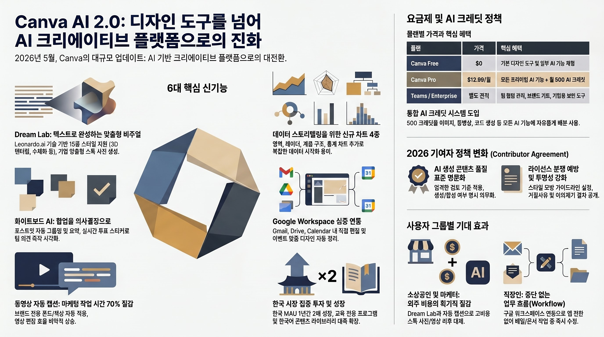

# 캔바(Canva) AI 2.0

> 2026년 4월 LA에서 발표. "디자인 도구에 AI를 넣은 게 아니라, AI 플랫폼에 디자인을 넣었다."

## 핵심 변화

| 기존 | AI 2.0 |
|------|--------|
| 템플릿 → 수동 편집 | "학교 포스터 만들어줘" 한마디로 완성 |
| AI는 이미지 생성만 | AI가 전체 디자인 프로세스 담당 |
| 한 번에 하나씩 | 대화하면서 계속 수정/개선 |

## 에이전틱 AI란?

AI가 단순 명령이 아니라 **스스로 판단하고 여러 단계를 자동 처리**하는 것.
"학교 축제 포스터 만들어줘" → 레이아웃 + 색상 + 텍스트 + 이미지 한번에!

## 숫자로 보는 캔바

| 지표 | 수치 |
|------|------|
| 월간 유저 | 2억 6,500만 명 |
| 유료 구독자 | 3,100만 명 |
| AI 필수 파트너 인식 | 77% |

## 2026 디자인 트렌드 핵심

1. **Reality Warp** — 현실과 비현실의 경계 허물기
2. **Imperfect by Design** — 의도된 불완전함의 미학
3. **AI Collage** — AI가 만드는 콜라주 아트

> 핵심: AI를 활용하되, 인간적 감성이 오히려 매력이 되는 시대

## 출처

- [Canva Create 2026 공식 발표](https://www.canva.com/newsroom/news/canva-create-2026-ai/)
- [캔바 2026 디자인 트렌드](https://www.canva.com/design-trends/)
